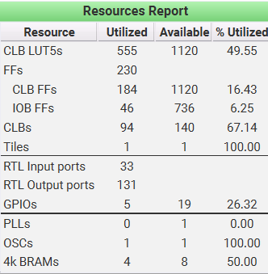
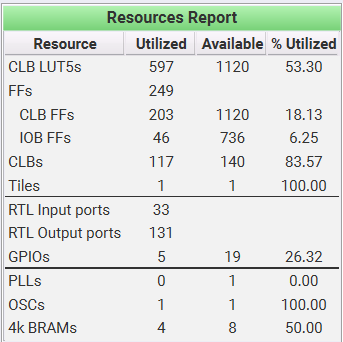
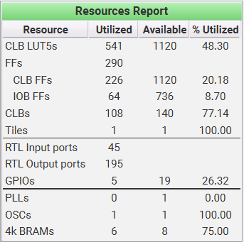

# todo: 
spi kinda effed up; rp2040 doesnt see the SPI op and hence it's timing out: the status poll never sees the done bit (frick my chud life)  

# wat dis
i cram the split off arithmetic and redc stuff and allat into two files, and split forward/inverse/basemul into three seperate parts to be streamed as bitstreams

why?
this is the most jank piece of shit code i may have written in my life, but again its my fault for going with a 1.2k LUT fpga instead of an ice40up5k and then trying to cram a kyber accelerator in here (hence why we went 177% over capacity )

**question:** why the split approach? why not use a shared arithmetic core, like before?

good question. been there, done that. thing is, the shared arithmetic core by itself was nice for saving space, but the pipelining and muxing and whatnot to attach shared core to every other unit (forward, backward, basemul) was taking up so much space on the freaking board that it would be wiser to just split off the three core processes and give them their own arithmetic core.
*tl;dr: thought of an elegant way to combine them, miserably failed; now we go the jank way to get atleast a demo on the damn thing.*

# no but really wat dis
jank ass ML-KEM accelerator for the vicharak shrike lite. swaps three fpga bitstreams at runtime (forward-inverse-basemul) since one of them wont fit, so we resort to swapping. 

# the files

## shared (every bitstream pulls these in):

- `fqmul_unit.sv`: the arithmetic core. serial 12-cycle multiply feeding a combinational montgomery reduce. the whole trick is q=3329 and q'=3327 are sparse in binary, so both constant-multiplies in REDC collapse into shift-adds (shifts are free wiring). one 13-bit adder, no handshake, no mux fabric. this last part is what saved my ass: the mux fabric to share ONE of these across all three units was the thing eating the board.
- `spi_target.sv`: the SPI byte interface. untouched, works, don't bother it. you have been warned.

## the three sequencers (one per bitstream):

- `fq_seq_f.sv` : forward NTT only. CT-DIT butterflies, incremental addressing (no barrel shifters), 10-state FSM. literally zero inverse/basemul logic exists in the file so theres nothing for the tools to (fail to) prune.
- `fq_seq_i.sv` : inverse NTT only. GS-DIF butterflies + the final scale-by-128⁻¹ pass.
- `fq_seq_b.sv` : basemul only. pairwise A⊗B, add-only ALU (no subtract path even exists here).

## the three tops:

- `ntt_top_fwd.sv` / `ntt_top_inv.sv` : coeff on BRAM0/1, twiddle on BRAM2/3. no BRAM4/5 ports : that freed silicon is why they fit.
- `ntt_top_bm.sv` : all six BRAMs (operand B lives on 4/5).

all three tops are named ntt_top, so it's the same P&R script every time, just swap which sequencer + top you feed it.

# does it fit tho
somehow now xd 

## forward:


## inverse


## basemul


# how do i actually run this thing
rp2040 does all the orchestration : loads the right bitstream over SPI before each phase, handles sequencing between phases. full kyber multiply of A,B → A:

```python
import shrike
shrike.flash("forward.bitstream")
spi_cmd(0x20, zetas)                    # load twiddles
spi_cmd(0x10, A); spi_cmd(0x30)         # NTT(A), poll 0x40 til done
A_ntt = spi_read(0x50)
spi_cmd(0x10, B); spi_cmd(0x30)         # NTT(B)
B_ntt = spi_read(0x50)

shrike.flash("basemul.bitstream")     # reconfig, few ms over SPI
spi_cmd(0x20, zetas)
spi_cmd(0x10, A_ntt); spi_cmd(0x11, B_ntt); spi_cmd(0x32)   # A⊗B
C_ntt = spi_read(0x50)

shrike.flash("inverse.bitstream")
spi_cmd(0x20, zetas)
spi_cmd(0x10, C_ntt); spi_cmd(0x31)     # INTT + scale
C = spi_read(0x50)
```

(yes yes there is a whole ass file for this just run it on the shrike its host.py)

reconfig is a few ms, nothing next to the compute (probably, i hope so lmfao). and if the EM rig only ever probes one operation, just flash that one bitstream and skip the swapping circus entirely.
IO planner heads up: keep SPI + clk/rst pins identical across all three plans so the rp2040 wiring never changes between swaps. only the BRAM tile usage differs (fwd/inv leave BRAM4/5 unassigned, bm uses all six).

# SPI command map:
```
0x10 load A          0x30 start forward
0x11 load B (bm)     0x31 start inverse
0x20 load zetas      0x32 start basemul
0x40 status (bit0=done)
0x50 read A back
```
# IO planner
The forward and inverse tops use only BRAM0–3 (coeff A on 0/1, twiddle on 2/3).
The basemul top additionally uses BRAM4/5 (operand B). So:

## forward.bitstream and inverse.bitstream : IO plan A
Pin/assign these external groups (BRAM4/5 are NOT present : do not assign them):
```
clk, clk_en, rst_n
spi_ss_n, spi_sck, spi_mosi        (inputs)
spi_miso, spi_miso_en              (outputs)
BRAM0_*  BRAM1_*                    (coeff A, lo/hi byte)
BRAM2_*  BRAM3_*                    (twiddle ROM, lo/hi byte)
```

Each BRAM group = RATIO[1:0], DATA_IN[7:0], WEN, WCLKEN, WRITE_ADDR[8:0], DATA_OUT[7:0], REN, RCLKEN, READ_ADDR[8:0]. Map each BRAMn_* group to the matching hard 4k-BRAM tile pins in the IO planner.

## basemul.bitstream : IO plan B
Same as plan A plus BRAM4_* and BRAM5_* (operand B, lo/hi byte) assigned to the two remaining BRAM tiles

# changes from old code
- fqmul is now serial-multiply + combinational Montgomery reduce (q,q′ are
sparse → constant multiplies are shift-adds). One 13-bit adder, no handshake,
no operand-mux fabric. That fabric was the thing busting the budget.
-n datapath narrowed 16→12 bit (all values < q = 3329).
- address generation is incremental (no barrel shifters).
- ~4–6× faster per op as a side effect (fwd 82k → 18k cycles in sim).
